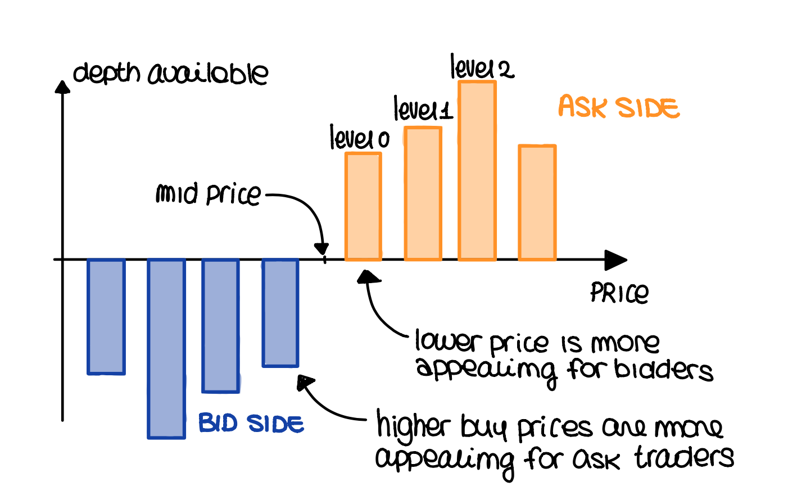
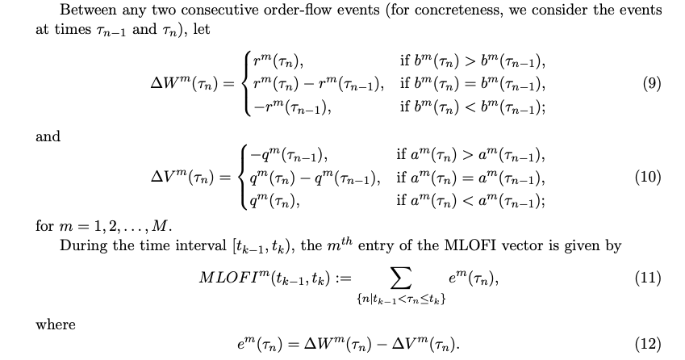
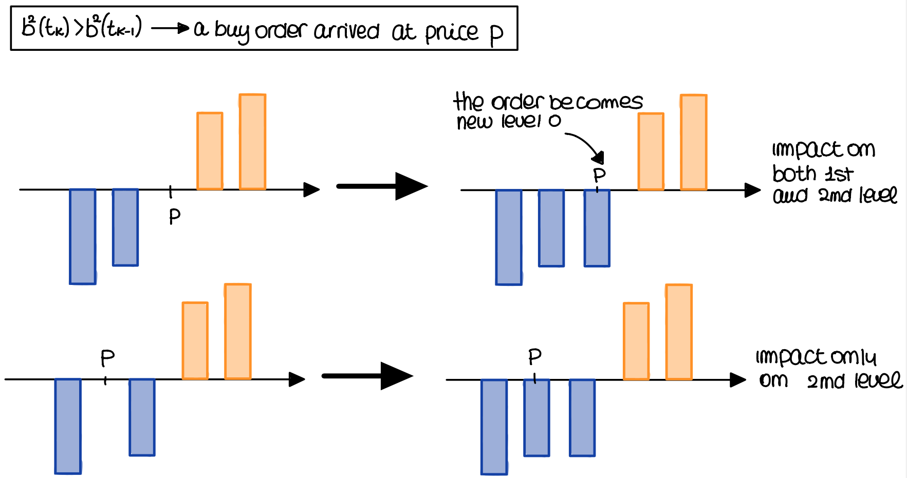
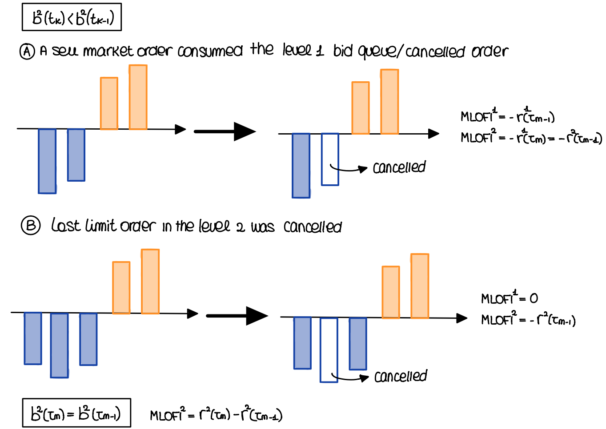
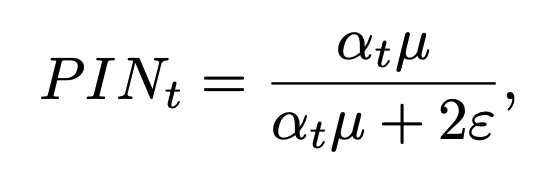
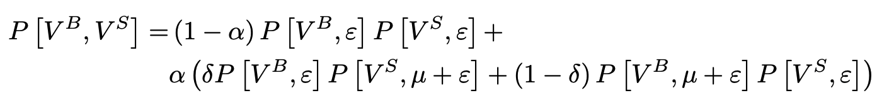

# LOB-feature-analysis
Complete dataset available [here](https://drive.google.com/drive/folders/1LP0KT5O1YQT1Vf3692nPeoT5SCsrJtUk?usp=sharing)

##  Setup a working environment (Linux only)
1. Create environment:

    `conda list --explicit > spec-file.txt`
    
    `conda create --name projectenv --file spec-file.txt`

2. Install package: go to `*/anaconda3/envs/projectenv/lib/python3.<version_num>/site-packages` in your file system and paste the .so file and the folder that you can find in `package` folder. 
    For instance:
    
    `cd /opt/anaconda3/envs/projectenv/lib/python3.8/site-packages`
    
    `cp path/db_lob.cpython-39-x86_64-linux-gnu.so .`
    
    `cp -r path/db_lob-0.0.5.dist-info .`
    
3. Work in the new enviroment:
    `conda activate projectenv`
    
4. Create kernel:
    `conda install ipykernel`
    `ipython kernel install --user --name=projectenv`

## What is a limit order book (LOB)?

 

## Order flow imbalance

 

 

 

## Probability of Informed Trading

The probability of informed trading (PIN) measures how likely it is that some players engage in informed trading, while the rest simply trade randomly.
Such quantity depends on the following parameters:
* alpha: probability that new information will arrive within the timeframe of the analysis;
* delta: probability 𝛿 that the news will be bad;
* mu: rate of arrival of informed traders;
* epsilon: rate of arrival of uninformed traders.

Once these parameters are known it can be computed by applying a maximum likelihood approach:

 

 

