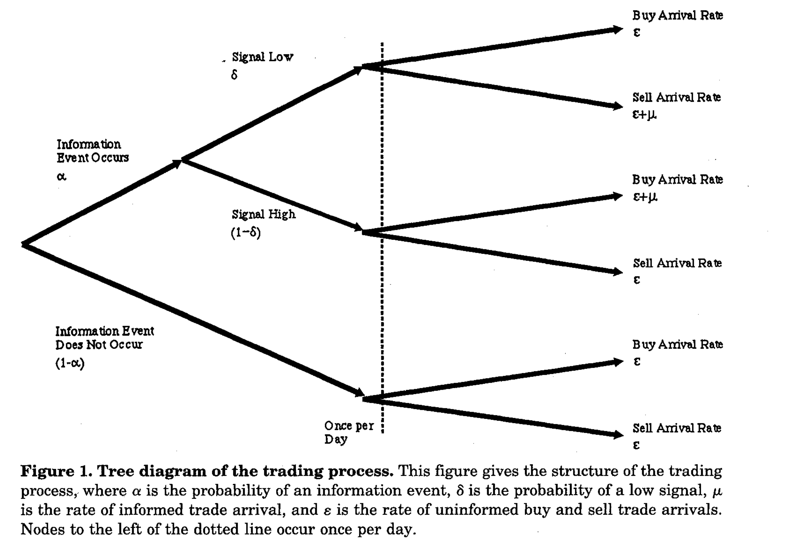
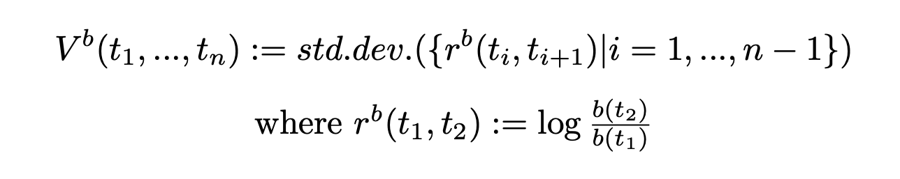

# LOB-feature-analysis
Complete dataset available [here](https://drive.google.com/drive/folders/1LP0KT5O1YQT1Vf3692nPeoT5SCsrJtUk?usp=sharing)

##  Setup a working environment (Linux only)
1. Create environment by cloning your own base enviroment:

    `conda list --explicit > spec-file.txt`
    
    `conda create --name projectenv --file spec-file.txt`

2. Install package: go to `*/anaconda3/envs/projectenv/lib/python3.<version_num>/site-packages` in your file system and paste the .so file and the folder that you can find in `package` folder. 
    For instance:
    
    `cd /opt/anaconda3/envs/projectenv/lib/python3.8/site-packages`
    
    `cp path/db_lob.cpython-39-x86_64-linux-gnu.so .`
    
    `cp -r path/db_lob-0.0.5.dist-info .`

3. Intall modules if needed:
    `pip install -r requirements.txt`
    
4. Work in the new enviroment:
    `conda activate projectenv`
    
5. Create kernel to work in the notebook:

    `conda install ipykernel`
    
    `ipython kernel install --user --name=projectenv`

## What is a limit order book (LOB)?
A LOB is the set of all active orders in a market at a given time. It is essentially a data structure that contains all the orders sent to the market, with their characteristics: sign of the order (buy or sell), price, volume, timestamp etc. So it contains, at any given point in time, on a given market, the list of all the transactions that one could possibly perform on this market.

 

The main idea is that trades occur when orders of different sides match their prices: a side takes on the role of the *aggressor* at a given price, and if there is a resting order, i.e. *limit* order, on the other side at the same price the trade happens.

Therefore, since bidders want to buy at the lower possible price, the most appealing order for a bidder is the level of the ask side corresponding to the lower price. On the other hand, traders on the ask side want to sell at the highest price, thus the most appealing trades correspond to the highest price on the the bid side.

### Types of orders 
Essentially, three types of orders can be submitted:

* **Limit order:** to specify a price at which one is willing to buy or sell a certain number of shares, with their corresponding price and quantity, at any point in time;
* **Market order:** to immediately buy or sell a certain quantity, at the best available opposite quote;
* **Cancellation order:** to cancel an existing limit order.

## How to build a LOB by processing trade messages?

### Messages and volume bars
To build a LOB we should start considering a list of messages in the trade market: every message correspond to a certain action in the market that can modify the structure of the LOB.
We are working on a given list of messages that can be processed by employing db-lob, A LimitOrderBook implementation for Deutsche Börse. With numpy interfacing [8]. 

The main workflow follows:

1. A message is read in the trade market and it is casted to the right kind of message;
2. Informations of the messages are employed to update the state of the book;
3. Messages are collected until the cumulative traded volumes
exceed a fixed **threshold**;
4. Once the threshold is exceed a bar is created, and the data inside it gets
aggregated.

The idea behind this approach is that, instead of aggregating data according to a fixed discetization of time or sampling frequency, we aggregate data focusing on the **activity of a security**. This way the threshold value represents the "activity threshold".

Another parameter that is required by the LOB is the tick size. In an order
book, the possible prices at which a security is traded are discrete, the discretization interval is referred as tick size.

In our analysis we fix: 

`volume_threshold = 1000000`

`ticksize = 0.0001`

### Studying the time evolution of a LOB

A LOB can be employed to study the time evolution of the market, indeed for each state of the book, a set of features can be extracted and computed.

We provide two different approaches to study the time evolution of the book:

1. Features extraction from each volume bar every time the threshold is exceeded;
2. Features extraction for each message that actually changes the state of the book.

Moreover, we focus on the study of four features that can be extracted by a LOB:

1. Distribution of orders sizes;
2. Order flow imbalance for price prediction;
3. Probability of informed trading;
4. Volatility.

## Features extraction
### Distribution of order sizes

An interesting quantity to study is the frequency of trades per trade size, we could use such quantity to observe two different trends:

1. **Trade frequency vs trade size:** we would expect the first to decrease as the second increases, since high price order should be less frequent;

2. **Distribution of more frequent order sizes:**  in general trades with round values (5, 10, 20, 50 and so on) are exceptionally common, because human traders tend to rely on GUIs that provide buttons with round values. Nevertheless, Silicon traders instead prefer to use randomized sizes, thus by studying the distribution of order sizes we could try to infer the nature of the traders.

### Order flow imbalance

The LOB can be used to see how the shift in orders volumes and prices can give information about the future movement of prices. In particular, the Order flow imbalance (OFI) and its multi-level counterpart Multi Level OFI (MLOFI), may be employed as a price predictor. 
For instance, if we consider the first level of the book informally define the order flow imbalance as the imbalance between demand and supply at the best bid and ask prices. Thus, it has an explanatory power of the traders' intentions.

The formal definition follows:

 

where b_m(t) and a_m(t) are respectively bid and ask prices at level m at time t and r_m(t) and q_m(t) are the corresponding volumes.

Let us now consider as an examples how the LOB evolves if we consider it up to the second level:

 

 

### Probability of Informed Trading

The probability of informed trading (PIN) measures how likely it is that some players engage in informed trading, while the rest simply trade randomly.
Such quantity depends on the following parameters:

* alpha: probability that new information will arrive within the timeframe of the analysis;
* delta: probability 𝛿 that the news will be bad;
* mu: rate of arrival of informed traders;
* epsilon: rate of arrival of uninformed traders.

 

Once these parameters are known it can be computed by applying a maximum likelihood approach:

 

where the parameters maximize the product of likelihood computed on each interval of time. Thus, we discretize time, for each interval we compute the following quantity, as a superposition of poisson PMF:

 

and then we optimize the product of all the likelihoods on the whole day.

### Volatility

The volatility of an asset provides some indication of how risky it is. All else held equal, an asset with higher volatility is expected to undergo larger price changes than an asset with lower volatility.

We can estimate the probability by noting the price returns at either regular time intervals or every *n* market orders. The second option would allow us to compare volatilities of assets with different sampling frequencies. We define the *realized volatility per trade*:

 

Thus, we estimate the volatility of both sides at the 1st level of the book.

## Resources
[1] *The Price Impact of Order Book Events*, R. Cont, A. Kukanov, S. Stoikov (2013)

[2] *Multi-Level Order-Flow Imbalance in a Limit Order Book*, K. Xu, M. D. Gould, and S. D. Howison

[3] *Advances in Financial Machine Learning*, Lopez de Prado (2018), chapter 19.5.1.

[4] *Liquidity, Information, and Infrequently Traded Stocks*, D. Easley et al. (1996), The Journal of Finance, 51:4, 1405-1436.

[5] *Limit Order Books* F. Abergel, M. Anane, A. Chakraborti, Cambridge University Press

[6] *Quantitative finance for physicist: an introduction*, A B. Schmidt

[7] *Limit Order Books* Martin D. Gould et al. (2013), Quantitative Finance, 13:11, 1709-1742.

[8] *db-lob, A LimitOrderBook implementation for Deutsche Börse. With numpy interfacing*, Andrea Perin, Federico Graceffa 
